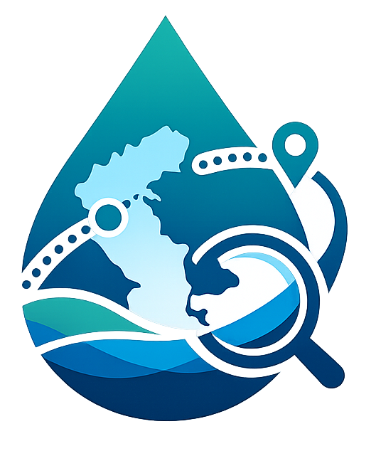
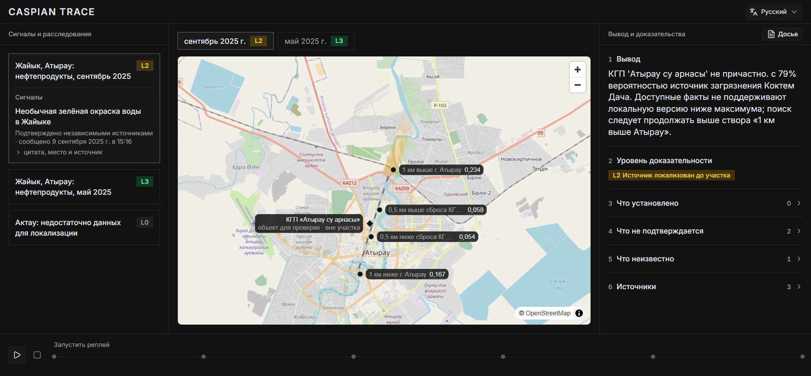

# Каспийский след

<p align="center">
  
</p>

<h1 align="center">Каспийский след</h1>

<p align="center">
  <strong>Сервис, который помогает журналистам и экологическим организациям собирать разрозненные сообщения о загрязнении Каспия в одну понятную и проверяемую картину.</strong>
</p>

<p align="center">
  
  
  
  
  
</p>

<!-- Замените ссылки перед публикацией -->

<p align="center">
  <a
    href="https://caspian-trace-web.vercel.app/landing"
    target="_blank"
    rel="noopener noreferrer"
  >
    🚀 Live Demo
  </a>
  ·
  <a
    href="https://docs.google.com/presentation/d/1A_T_v7eEyJFu_f3uftzeZggxCNDT1xvE/edit?usp=sharing&ouid=113841808140956424271&rtpof=true&sd=true"
    target="_blank"
    rel="noopener noreferrer"
  >
    📊 Presentation
  </a>
  ·
  <a href="docs/">
    📚 Documentation
  </a>
</p>

---

<p align="center">
  
</p>

---

## Что это за проект? 🌊

**«Каспийский след»** помогает быстро разобраться в сообщениях о загрязнении воды.

Сервис собирает материалы из открытых источников, показывает их на одной странице и помогает понять:

- что известно точно;
- какие версии ещё требуют проверки;
- где может находиться участок загрязнения;
- каких данных не хватает для уверенного вывода.

> Проект не назначает виновных. Он отделяет подтверждённые факты от предположений.

---

## Проблема 🔍

Информация об экологических происшествиях часто разбросана по новостям, официальным сайтам и отдельным документам.

Журналистам и общественным организациям приходится вручную искать источники, сравнивать сообщения и проверять, насколько выводы соответствуют фактам.

---

## Решение ✅

«Каспийский след» объединяет доступную информацию в одном месте:

```text
Сообщение о проблеме
        ↓
Проверка открытых источников
        ↓
Карта и понятная последовательность событий
        ↓
Осторожный вывод со ссылками на документы
```

Когда информации недостаточно, сервис прямо сообщает об этом вместо того, чтобы придумывать ответ.

---

## Основные возможности ✨

- единая лента экологических событий;
- карта и понятная история расследования;
- ссылки на исходные публикации и документы;
- разделение фактов, версий и неизвестных данных;
- повторный просмотр того, как менялся вывод;
- готовое досье для журналиста или организации;
- работа даже при временной недоступности части источников.

---

## Как устроен проект? 🧩

```text
Открытые источники
        ↓
Сбор и проверка данных
        ↓
Хранилище проекта
        ↓
Сервер приложения
        ↓
Веб-интерфейс
```

### Технологии

- React и TypeScript;
- NestJS;
- PostgreSQL и Supabase;
- Prisma;
- Swagger;
- Jest и Playwright.

---

## Быстрый запуск 🚀

### Требования

- Node.js `20.19+`, но ниже `21`;
- npm;
- PostgreSQL или Supabase;
- Git.

### Установка

```bash
git clone https://github.com/kiratonine/caspian-trace.git
cd caspian-trace
git switch integration/final-demo
npm ci
```

### Переменные окружения

В репозитории уже есть готовые примеры:

```bash
cp apps/api/.env.example apps/api/.env
cp apps/web/.env.example apps/web/.env
```

Заполните значения в `apps/api/.env`.  
Для frontend стандартные значения обычно можно оставить без изменений.

### Подготовка базы данных

```bash
npm run prisma:validate
npm run prisma:generate
npm run prisma:migrate:deploy
npm run prisma:seed
npm run prisma:bootstrap:investigations -w api
```

### Запуск

Терминал 1:

```bash
npm run dev:api
```

Терминал 2:

```bash
npm run dev:web
```

Откройте:

```text
Web:     http://localhost:5173
API:     http://localhost:3000/api
Swagger: http://localhost:3000/api/docs
```

---

## Проверка проекта 🧪

```bash
npm run typecheck
npm run lint
npm run test
npm run build
```

---

## Структура репозитория

```text
caspian-trace/
├── apps/
│   ├── web/                  # Веб-интерфейс
│   └── api/                  # Сервер приложения
├── packages/
│   ├── contracts/            # Общие форматы данных
│   └── investigation-core/   # Правила анализа
├── data/                     # Проверенные материалы
├── docs/                     # Документация
└── package.json
```

---

## Roadmap 🛣

### Уже готово

- [x] лента экологических событий;
- [x] карта и просмотр деталей;
- [x] ссылки на исходные материалы;
- [x] история изменения выводов;
- [x] экспорт досье;
- [x] локальный запуск и тесты.

### Следующие шаги

- [ ] добавить новые регионы Каспия;
- [ ] упростить проверку новых материалов;
- [ ] запустить публичную версию;
- [ ] провести пилот с журналистами и экологическими организациями.

---

## Документация 📚

- [Документация проекта](docs/)
- [Настройки API](apps/api/.env.example)
- [Настройки frontend](apps/web/.env.example)
- [Swagger](http://localhost:3000/api/docs)

---

<p align="center">
  <strong>«Каспийский след» помогает увидеть целостную картину и честно показывает границу между фактами и предположениями.</strong>
</p>
